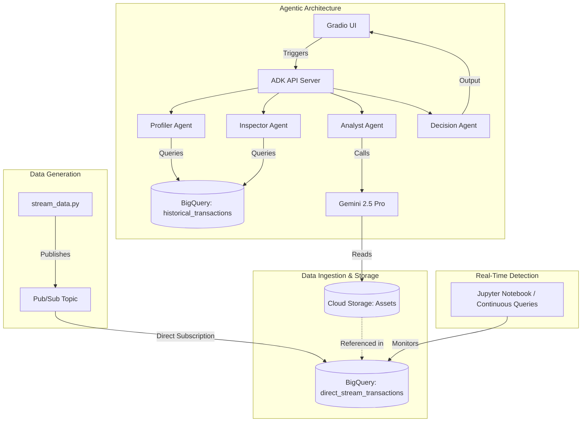

# Fraud Prevention Demo on GCP (SMS Pumping & AIT)

This repository contains the code and configuration for a Fraud Prevention Demo on Google Cloud Platform (GCP), focusing on CPaaS fraud scenarios like SMS Pumping and Artificially Inflated Traffic (AIT). The demo showcases how to use synthetic data generation, advanced analytics with BigQuery (including Continuous Queries and Object Tables), and generative AI with Vertex AI to detect and prevent fraudulent transactions.


## Architecture Diagram



## Project Structure

The project is organized into the following phases:

### Phase 1: The Multimodal Data Layer (Structured + Unstructured)

This phase establishes the data foundation handling both structured logs and unstructured data.

*   **Structured Data**: Standard SMS logs (Timestamp, Sender ID, Destination, Cost, IP Address) streamed via Pub/Sub into BigQuery.
*   **Unstructured Data (The Multimodal Twist)**:
    *   **Call/Audio Snippets**: For "Flash Calls", metadata is stored in BQ and audio/signaling logs in Cloud Storage.
    *   **Image Metadata**: For "Smishing", screenshots of fraudulent websites are stored in Cloud Storage.
*   **Integration**: Use BigQuery Object Tables to create a unified view, allowing Gemini models to run directly over images/audio files using SQL to extract "Intent" or "Risk Score".

### Phase 2: Real-Time Detection: Continuous Queries

This phase involves developing the core logic for processing transactions and detecting fraud in real-time.

*   **Continuous Queries (CQ)** act as your "Always-On" radar, processing data as it arrives.
*   **The Logic**: Compare streaming traffic against a "Historical Baseline" table.
*   **The Query Pattern**:
    *   **Windowing**: Calculate the count of messages per destination in a 30-second sliding window.
    *   **Join**: Compare this to the 30-day average for that same destination.
    *   **Threshold**: If $CurrentRate > (HistoricalAverage * 10)$, trigger an event.

### Phase 3: The Agentic Architecture: "The Investigator"

This phase introduces a multi-agent system to handle alerts and investigate potential fraud autonomously.

*   **Framework**: Built using Google Agent Development Kit (ADK).
*   **Orchestration**: Uses a `SequentialAgent` pipeline.
*   **Sub-Agents**:
    *   **Profiler**: Queries BigQuery for customer history and automatically finds the last known IP and associated asset.
    *   **Inspector**: Queries BigQuery for IP reputation.
    *   **Analyst**: Uses Gemini 2.5 Pro to analyze message text and GCS assets (images/audio) for fraud patterns.
    *   **Decision**: Makes the final decision based on inputs from previous agents.
*   **UI**: A Gradio interface allows human-in-the-loop interaction to trigger investigations and view agent reasoning.

#### Possible Decisions:
*   **ALLOW**: Traffic is deemed legitimate based on historical patterns and low content risk score.
*   **QUARANTINE**: Traffic is flagged as potentially fraudulent (e.g., high risk score from Gemini or suspicious IP history) and should be blocked or reviewed.


## How to Run the Streaming Simulation

This method uses a BigQuery Subscription in Pub/Sub to stream data directly into BigQuery.

### Step 1: Create Pub/Sub Topic with Schema
Use the provided `schema.json` to create the topic with a schema.

```bash
gcloud pubsub schemas create fraud-schema --type=avro --definition-file=schema.json
gcloud pubsub topics create fraud-transactions-topic --schema=fraud-schema --message-encoding=json
```

### Step 2: Create BigQuery Table
Create the `direct_stream_transactions` table.

```bash
bq mk --table fraud-prevention-demo:fraud_data_new.direct_stream_transactions timestamp:TIMESTAMP,sender_id:STRING,destination:STRING,cost:FLOAT,ip_address:STRING,unstructured_ref:STRING
```

### Step 3: Create BigQuery Subscription
Create the subscription that maps fields directly.

```bash
gcloud pubsub subscriptions create direct-bq-sub-new \
    --topic=fraud-transactions-topic \
    --bigquery-table=fraud-prevention-demo:fraud_data_new.direct_stream_transactions \
    --use-topic-schema
```

### Step 4: Run the Streamer
Only run the streamer script.

```bash
python3 data_generator/stream_data.py
```

## How to Run Phase 3: Agentic Architecture

Follow these steps to run the multi-agent ADK server and the Gradio UI.

### Step 1: Activate Virtual Environment
Ensure you have activated the virtual environment in both terminals.

```bash
source .venv/bin/activate
```

### Step 2: Authenticate with Google Cloud
Ensure you are authenticated to access BigQuery and Vertex AI.

```bash
gcloud auth application-default login
```

### Step 3: Run the ADK Backend Server (Terminal 1)
Start the API server on port 8001.

```bash
adk api_server --port 8001 agents
```

### Step 4: Run the Gradio UI (Terminal 2)
Start the frontend interface.

```bash
python3 ui/app.py
```

### Step 5: Verify the Flow
Open the Gradio URL in your browser (usually `http://127.0.0.1:7860`), enter a destination number (e.g., `263222222222`), and click Submit to see the automated investigation!

## How to Run the Demo Notebook

We have created a Jupyter notebook to demonstrate real-time fraud detection and multimodal analysis.

1.  Open `bq_capabilities/continuous_queries.ipynb` in Colab Enterprise or your Jupyter environment.
2.  Follow the instructions in the notebook to:
    *   Monitor the stream and detect fraud spikes in real-time.
    *   Set up Object Tables and Gemini Remote Models.
    *   Run multimodal analysis on flagged transactions.

## License

This project is licensed under the Apache License 2.0. See the [LICENSE](LICENSE) file for details.
